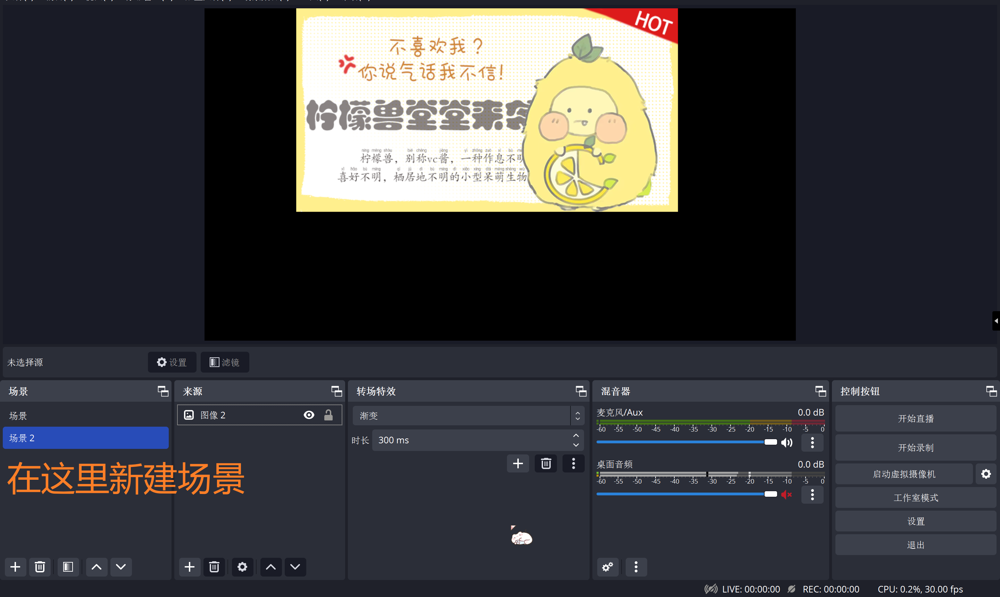

# OBS使用

> 参考：[BV1W34y1o7E9](https://www.bilibili.com/video/BV1W34y1o7E9/?spm_id_from=333.337.search-card.all.click&vd_source=758e8ac27e7b35b31565c783c4784ac5) （版本有改动）
>
> OBS官网：[https://obsproject.com/](https://obsproject.com/)

## 添加设备

### 添加图象/图象幻灯片放映/文字/媒体源/色源

直接用鼠标拖动调整大小是按比例缩放，按住<kbd>Shift</kbd>再调整可以取消比例锁定

按住<kbd>Alt</kbd>可以裁剪图象

媒体源如下所示（以寒假小作业为例子）

色源（一个色块）：

> 注：音频相关不好以图片形式展示，这里不做表述。

### 添加显示屏

#### 游戏采集/窗口采集

[游戏采集]——[模式-采集特定窗口]、[窗口]-选择所需窗口

[显示屏采集] / [游戏采集] 右侧的眼睛可以选择显示与否

窗口采集时被采集窗口不能最小化

（采集前最小化则OBS找不到该窗口，无法采集；采集后最小化则界面保持最小化前的状态）

### 添加视频采集设备 

电脑摄像头可以直接添加，外接摄像头需要通过USB连接到电脑上。
注意：一个摄像头只能被一个软件抓取。如果该摄像头已经被腾讯会议等抓取，就不能被OBS抓取了

### 添加音频输/输出采集

输入的音频可以在右侧混音器监测到

音频输出同理（注意输出的是哪里的音频，以下图为例，带着耳机故扬声器频道没有声音）

### 新建/添加场景

可以在一个场景中添加另一个场景（处在上位的[来源]显示在最上方，如这里文本[图象]）

## 参数设置（仅针对直播/需要后期剪辑视频的情况）

右下角[设置]——[输出]——[输出模式-高级]

### 录像设置

[设置]——[输出]——[输出模式-高级]——[录像]

[类型-标准]——[录像路径]-想要的保存路径——[录像格式-MPEG-4(.mp4)]——[视频编码器-x264[^1]]——[音轨-2和3] [^2]
[编码器设置-码率控制-VBR] （要高清晰度可以提高码率，显卡编码VBR模式下的码率和最大码率同理[^3]）

[高级音频设置]——一个调成1、3轨道，一个调成1、2轨道
*目的是后期pr剪视频时可以区分出桌面音频和麦克风音频

然后就可以开启录制了（开启录制后，开启按钮变成停止录制按钮）

### 直播设置

[设置]——[输出]——[输出模式-高级]——[直播]

[视频编码器]-选择合适的编码器[^4]——[速率控制-VBR]——调整码率
码率越高则清晰度越高，具体选择根据网速而定，参考如下。【省流：6000】

> 参考方案（可不看）：[测速网](https://www.speedtest.cn/)，点击测速，出现的上传速率后加三个零为可调的最高码率。
> 如下图表示可设置的最高码率为13000，但是b站容不下特别高，观众看起来也会卡。建议b站直播码率在6000左右。
> 

## 直播

### b站直播

b站——[直播中心]——相关设置（分区、标题等）——[开始直播]——出现推流码等

OBS——[设置]——[直播]——[服务]
服务选b站，则只需要复制`串流密钥`（据说容易崩）
【建议】服务选自定义，则分别复制`服务器地址`和`串流密钥`到`服务器`和`推流码`
服务器地址选srt地址更稳定

设置完成后点击[开始直播]

### 钉钉直播（腾讯会议等应该类似）

直播后摄像头选择OBS虚拟摄像头，这时候可能会出现如下所示画面，这是因为OBS虚拟摄像头未开启。开启后，OBS界面的画面可以在钉钉直播中显示。

### 工作室模式

直接进行直播或录制时，直播/录制画面与自己做的调整是同步的。

如果想先调整，直到效果满意了再同步到直播/录制中该怎么办呢？可以使用工作室模式

下图中，把vc酱隐藏后，它并没有在直播中消失。推动两个画面中的拉杆后，直播画面同步。

## 以其他形态出击！（以live2D为例）

VTube Studio（以此软件举例）可以通过面捕将你的动作实时同步到live2D模型上，如下所示

开启Vtube Studio的虚拟摄像头后，可以把它显示在OBS里，让它代替你直播。（具体实现就不算在OBS部分了，这里不多提）

---

注释区：

[^1]:cpu编码（x264），显卡编码（H.264）则前缀可能因为电脑显卡不同而不同，具体参见[cv17800005](https://www.bilibili.com/read/cv17800005)。 参考教程使用的是台式电脑，选择的是显卡编码。 笔记本电脑可以看是集成显卡（集显则显卡编码效果差）还是有独立显卡（具体效果对比参见上面链接）。 我因为电脑是集显，选择了cpu编码（但是测试的时候发现码率2500左右的时候差别不大，清晰度都一般）。  查看电脑显卡的方式：此电脑-[右键]-管理-设备管理器-显示适配器，只有一个则是集显，有不止一个则有独显。
[^2]:仅作为例子，可以自行调整。接下来就会讲到，点击混音器左下角设置图标，可以自行设置输入/输出音频的轨道，这个音频轨道和这里对应。比如，桌面采集音频设置轨道1和2，麦克风设置轨道1和3。于是1轨道有两种声音，2/3轨道分别只有桌面音频/麦克风的声音。而这里我们输出的音轨是2和3，在pr中可以看到确实有两条音轨（图片在上方）。
[^3]:参考教程的版本中是比特率和最大比特率。
[^4]:参照注释一。